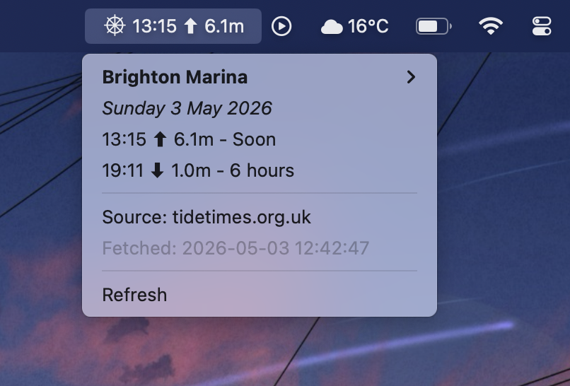

# Tide Times SwiftBar Plugin

A SwiftBar plugin that displays real-time tide information for UK coastal locations, with support for tide stations from tidetimes.org.uk.

[](screenshot.png)

## Features

- **Multi-location support**: Switch between any UK tide locations
- **Live tide data**: Fetches current and upcoming tide events from tidetimes.org.uk
- **Time-until indicator**: Shows "Soon" for tides within 1 hour, or hours for later tides
- **Persistent selection**: Remembers your selected location across plugin refreshes
- **Clean formatting**: 
  - Tide depth shown to 1 decimal place
  - High/Low tide displayed as ⬆/⬇ arrows
  - Current date displayed in menu
- **Updates every 30 minutes**: Automatic refresh via SwiftBar

## Installation

1. **Place the plugin in your SwiftBar plugins directory**:
   - Download `tide-times-uk.30m.sh` from this repository
   - Move it to your SwiftBar plugins folder (e.g., `~/Library/Application Support/SwiftBar/Plugins/`)
2. **Refresh SwiftBar** or restart it to pick up the new plugin

3. **Click the plugin** in your menu bar to open the dropdown

## Configuration

Configuration and cache files are stored in `~/.config/tide-times-swiftbar/`:

- `selected-location` – Your currently selected location (slug)
- `locations.tsv` – Cached list of all available tide stations

You can manually edit the selected location by editing `selected-location`:
```bash
echo "dover" > ~/.config/tide-times-swiftbar/selected-location
```

To reset everything:
```bash
rm -rf ~/.config/tide-times-swiftbar
```

## Data Source

- **Tide data**: [tidetimes.org.uk](https://www.tidetimes.org.uk) (RSS feeds)
- **Location list**: [tidetimes.org.uk/uk-tides](https://www.tidetimes.org.uk/uk-tides)
- **Supported locations**: 600+ UK tide stations including harbours, bays, and estuaries

## Requirements

- **SwiftBar** installed
- **curl** – for fetching data (standard on macOS)
- **perl** – for text processing (standard on macOS)

## Other

This plugin is provided as-is for personal use with tidetimes.org.uk data.
